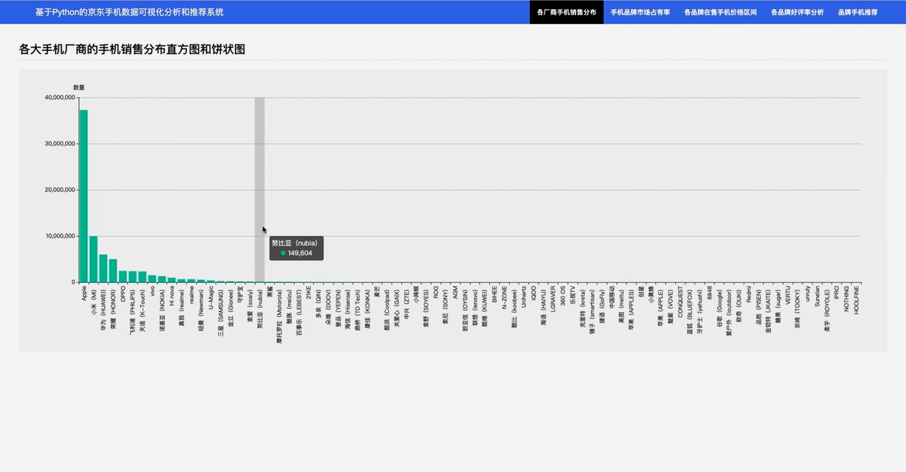
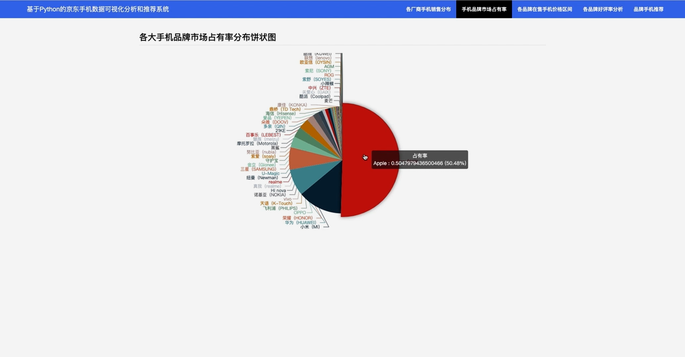
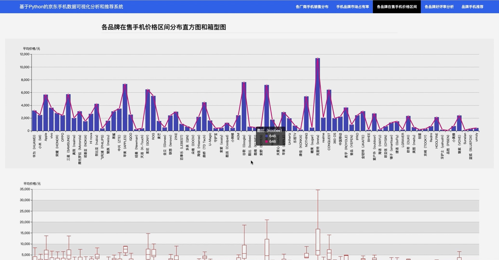
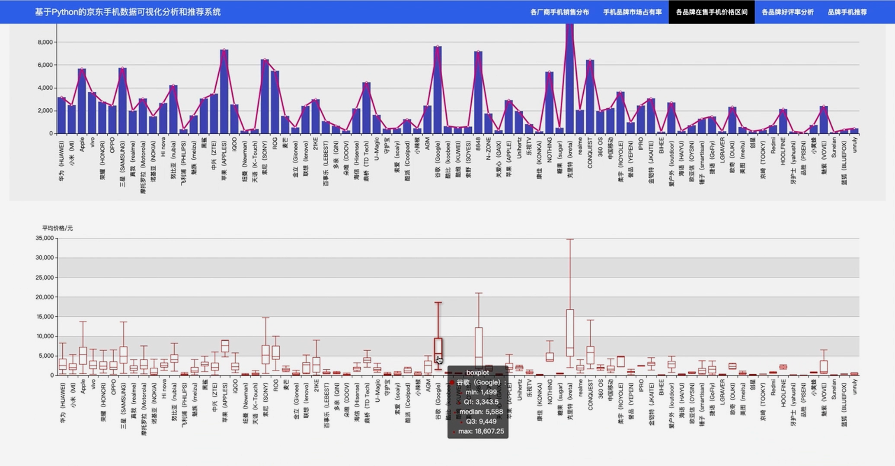
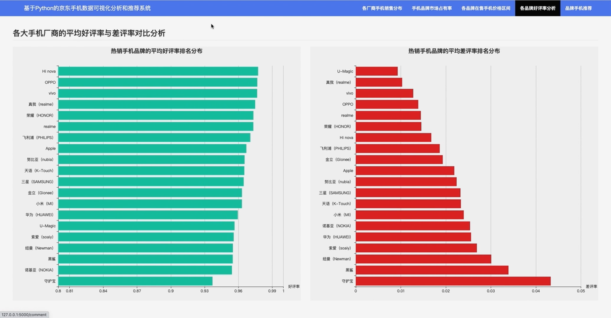
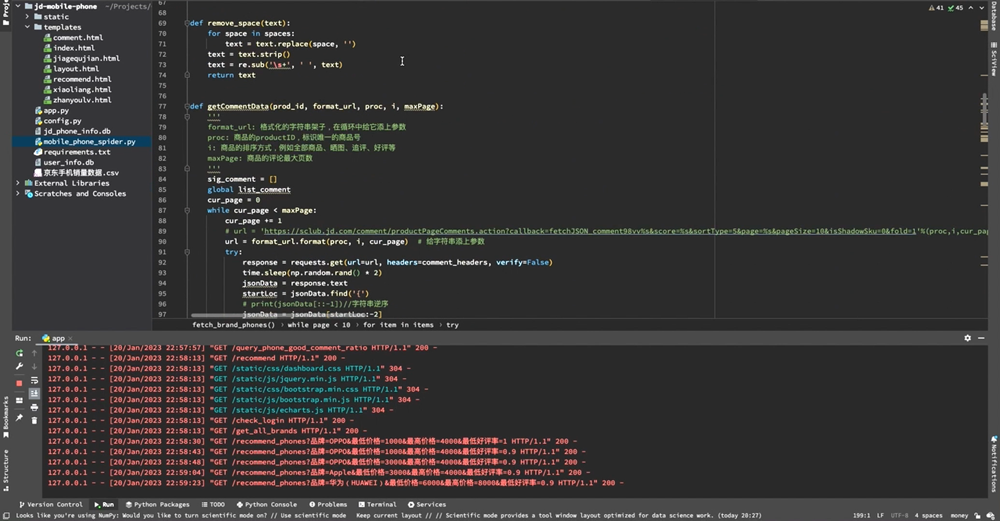

## 计算机毕业设计Python+图神经网络手机推荐系统 手机价格预测 手机可视化 手机数据分析 手机爬虫 Django Flask Spark 知识图谱

## 要求
### 源码有偿！一套(论文 PPT 源码+sql脚本+教程)

### 
### 加好友前帮忙start一下，并备注github有偿纯python手机推荐
### 我的QQ号是2827724252或者798059319或者 1679232425或者微信:bysj2023nb

# 

### 加qq好友说明（被部分 网友整得心力交瘁）：
    1.加好友务必按照格式备注
    2.避免浪费各自的时间！
    3.当“客服”不容易，repo 主是体面人，不爆粗，性格好，文明人。
## 介绍
基于知识图谱的图神经网络&图注意力推荐算法加持
 pytorch+neo4j+GNN+GAE模型实现推理
 (本人手写实现模型算法，算法代码1万行，吊打清华北大斯坦福)
本项目旨在通过Python技术栈对京东平台上的手机数据进行抓取、分析并构建一个简单的手机推荐系统。
主要功能包括：
网络爬虫：从京东获取手机数据；
数据分析：统计各厂商手机销售分布、市场占有率、价格区间和好评率；
可视化展示：使用ECharts进行数据可视化；
推荐系统：根据分析结果为用户推荐手机。

## 演示视频
https://www.bilibili.com/video/BV1A1D1YqEdW/?spm_id_from=333.999.0.0

## 演示截图

